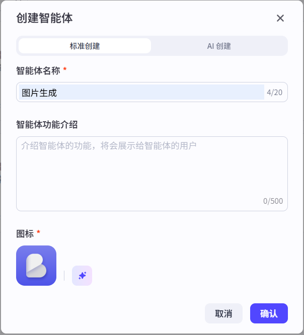
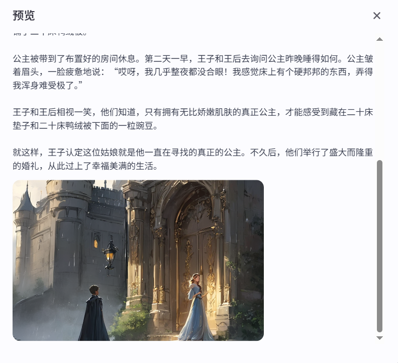

教程内容：https://github.com/datawhalechina/coze-ai-assistant 
学习网站：https://www.datawhale.cn/learn/content/105/3259 
打卡链接：https://exn8g66dnwu.feishu.cn/share/base/form/shrcngnZZ5mTmLleoPX2TeNhq7d 
|任务信息 |DDL
|:-----------| -------------
|Task1-第一章(智能体与工作流)&第二章(Coze介绍)|6.17
|Task2-第三章(智能体)|6.19
|Task3-第四章(资源的玩法)|6.22
|Task4-第五章(工作流)|6.25
|Task5-第六章(应用)|6.26
|Task6-第七章(自选3个案例)|6.29
# Task1-第一章(智能体与工作流)&第二章(Coze介绍)
1、智能体与工作流的对比
|        |智能体 |工作流
|--------|-------------|-----------------|
“是什么”|自动化的“助手”，用来执行特定任务|一系列任务的流程，决定了每个步骤应该做什么
“做什么”|擅长做一些具体的、重复性的任务|可以处理一个完整的过程
优势|灵活，能够适应变化|有清晰的结构和步骤
劣势|缺乏全局视角，如果没有明确的整体流程规划，容易导致任务之间衔接混乱或重复执行。|只能按照预先设定的规则和任务做事，如果遇到超出范围的情况，它就不知道怎么办了
适合的业务||重复性工作多、业务流程固定 

PS1.指出一个疑惑：教程中关于智能体和工作流的优缺点是不是混淆了？

PS2.一点启发与思考：“用老板心态大胆想象一下，把你目前赚钱手段 AI 工作流化外包给 AI，你接下来需要做什么？”
暂不头脑风暴老板的心态，思考一个问题，假如你实现了这个工作流并且它表现优异，该如何描述并写到简历中呢？结合最近看到的评论记录一下思路：（业务+技术角度）1.发现业务链路中的折损；2.形成优化方案；3.调研选型到Coze；4.利用模型能力；5.落地上线；6.回收数据；7.展示业务结果

2、Coze推荐学习资源 
【图文教程篇】 
1、4万字教程-COZE/扣子与智能体入门（飞书文档） [飞行社](https://www.feishu.cn/community/article?id=7415932355996549148&%3Ffrom=ai_search&from=share). 
作者：唯庸 有作者的[优质案例教程](https://www.feishu.cn/community/article?id=7394346214239502338) 
2、coze官方教程（网页）扣子 - [文档中心](https://www.coze.cn/open/docs/guides/quickstart) 

【视频教程】
官方教程：[扣子官方教程&宣传片（对外版）](https://bytedance.larkoffice.com/docx/MU2gdBhluo1aCJx9g5Sc1vwWnte)

3、练手 
PS.第一个案例来自教程，后面的案例来自唯庸的教程 
|智能体        |Prompt|Coze助手对话|编排作品|发布、使用作品|
|--------|-----|--------|-----------------| ----|
|[英语口语陪练搭子](https://www.coze.cn/store/agent/7518608658130190345?bot_id=true)|我想要一个英语口语陪练搭子|||
|[汽车销售bot](https://www.coze.cn/store/agent/7518620264860221480?bot_id=true)|创建一个对话机器人，是一个20年经验的资深汽车销售，向用户推销以及答疑汽车相关的问题|||
|[金融课程销售](https://www.coze.cn/store/agent/7518624721157226496?bot_id=true)|创建一个对话机器人，是一个20年经验的资深金融产品销售，向用户推销以及答疑金融财经课程相关的问题||||
|[图片生成](https://www.coze.cn/store/agent/7518655358068801536?bot_id=true)|根据用户的需求，调用 text2image 插件，将用户需求作为prompt参数带入|||
|[故事配图生成](https://www.coze.cn/store/agent/7518659171983245350?bot_id=true)|你是一个故事生成机器人，当用户给你发送故事创意时，调用 story_img 工作流||||

# Task2-第三章(智能体)
1、练手：夸夸机器人（[作品](https://www.coze.cn/store/agent/7518688722599477283?bot_id=true)）
|1-构建智能体 |2-编写提示词|3-发布作品|
|--------|-----|--------|
||||

2、为智能体配置多种扩展能力 
步骤1：更换模型（角色扮演Pro模型） 
步骤2：设置多样性与输入输出（角色扮演模型修改为“创意模式”和“携带上下文轮数”） 
步骤3：添加插件（BaiduSearch） 
步骤4：更换模型（工具调用模型） 
步骤5：配置卡片 
步骤6：配置触发器 
步骤7：添加知识库 
步骤8：长时记忆 
步骤9：设置开场白 
步骤10：设置背景图片

# Task3-零代码创建谷歌插件
